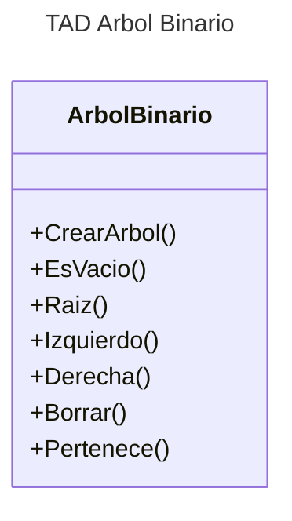

[](https://classroom.github.com/open-in-codespaces?assignment_repo_id=13952736)
# Proyecto - Tipos de Datos No Lineales

Las estructuras de datos no lineales son aquellas en las que cada elemento puede estar conectado con más de dos elementos y no hay una secuencia única para acceder a todos los elementos. Algunos ejemplos de estructuras de datos no lineales incluyen árboles, grafos, tablas hash, etc.

En el caso de los árboles, cada elemento (llamado nodo) está conectado a otros nodos a través de enlaces o aristas. Un nodo puede tener varios hijos, pero solo un padre. El nodo sin padre se llama raíz del árbol.

En los grafos, cada nodo puede estar conectado a cualquier otro nodo. Los grafos pueden ser dirigidos (las conexiones tienen una dirección) o no dirigidos (las conexiones no tienen dirección).

Las tablas hash, por otro lado, utilizan una función de hash para asignar cada valor a un índice único en la tabla.

Estas estructuras de datos son fundamentales en la informática y se utilizan en una variedad de aplicaciones, como la representación de redes, la gestión de datos jerárquicos, el enrutamiento de información, entre otros.


## Descripción del Problema
1. Árbol Binario
2. Recorrido en árboles binarios
3. Árbol Binario de Búsqueda
4. Árboles Binarios Equilibrados (AVL)
5. Grafos

**Este ejercicio implementa el TAD No Lineales**


## Diagrama de clases
[Editor en línea](https://mermaid.live/)



[Referencia-Mermaid](https://mermaid.js.org/syntax/classDiagram.html)

## Diagrama de clases UML con draw.io
El repositorio está configurado para crear Diagramas de clases UML con ```draw.io```. Para usarlo simplemente agrega un archivo con extensión ```.drawio.png```, das doble clic sobre el mismo y se activará el editor ```draw.io``` incrustado en ```VSCode``` para edición. Asegúrate de agregar las formas UML en el menú de formas del lado izquierdo (opción ```+Más formas```).
## Uso del proyecto con make

### Default - Compilar+Probar+Ejecutar
```
make
```
### Compilar
```
make compile
```
### Probar todo
```
make test
```
### Ejecutar App
```
make run
```
### Limpiar binarios
```
make clean
```
## Comandos Git-Cambios y envío a Autograding

### Por cada cambio importante que haga, actualice su historia usando los comandos:
```
git add .
git commit -m "Descripción del cambio"
```
### Envíe sus actualizaciones a GitHub para Autograding con el comando:
```
git push origin main
```
## Comandos individuales
### Compilar

```
find ./ -type f -name "*.java" > compfiles.txt
javac -d build -cp lib/junit-platform-console-standalone-1.5.2.jar @compfiles.txt
```
### Ejecutar ambos comandos en 1 sólo paso:
```
find ./ -type f -name "*.java" > compfiles.txt ; javac -d build -cp lib/junit-platform-console-standalone-1.5.2.jar @compfiles.txt
```

### Ejecutar Todas la pruebas locales de 1 Test Case
```
java -jar lib/junit-platform-console-standalone-1.5.2.jar -class-path build --select-class miTest.AppTest
```
### Ejecutar 1 prueba local de 1 Test Case
```
java -jar lib/junit-platform-console-standalone-1.5.2.jar -class-path build --select-method miTest.AppTest#appHasAGreeting
```
### Ejecutar App
```
java -cp build miPrincipal.Principal
```
Los comandos anteriores están considerados para un ambiente Linux. [Referencia.](https://www.baeldung.com/junit-run-from-command-line)
